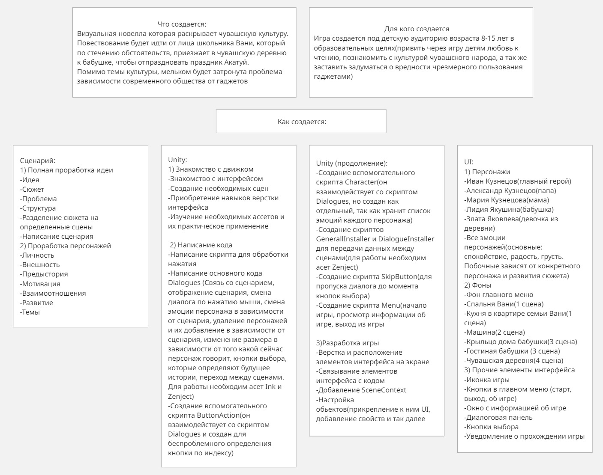

<h1 align="center">Мобильная игра "Акатуй" в жанре визуальная новелла </h1>

<h2>Описание</h2>
Данная игра разрабатывается как дипломная работа. Она представляет собой визуальную новеллу с интерактивным сюжетом, где выбор игрока влияет на развитие повествования. В будущем планируется добавление миниигр для интерактивности и усиления вовлеченности. Формат сочетает образовательную и развлекательную составляющие, позволяя игроку усваивать информацию через игровой процесс.

<h2>Анализ целевой аудитории</h2>
Целевая аудитория сайта — школьники изучающие чувашский язык и люди, заинтересованные в играх и изучении чувашской культуры 
Основные группы: школьники изучающие чувашскую культуру(9-18 лет), геймеры, люди изучающие чувашскую культуру

<h2>Анализ конкурентов</h2>
Прямых конкурентов в сфере игровой индустрии Чувашии не выявлено. Однако существуют косвенные конкуренты - традиционные источники информации (статьи, книги и учебные материалы), которые проигрывают проекту в подаче контента. Ключевое преимущество проекта заключается в уникальной игровой форме подачи материала, которая превращает изучение культуры из скучного процесса в увлекательное игровое приключение, обеспечивает эмоциональное вовлечение через интерактивный сюжет и визуальное оформление, позволяет усваивать информацию естественно через игровые механики и личный опыт. Такой подход делает изучение чувашской культуры доступным и интересным для современной аудитории, что дает проекту существенное преимущество перед традиционными методами обучения.

<h2>План разработки</h2>

<h2>Ссылка на скачивание </h2>
<a href="https://www.figma.com/design/R0YI7VVeclQTquqY6f75H1/Untitled?node-id=0-1&amp;p=f&amp;t=wGptOSa2A8P0VX5B-0">Открыть в Figma</a>

<h2>Скриншоты </h2>

<h4 align="center">
  
   
  На данном скриншоте изображены главные страницы, которые содержат информацию об актуальных фестивалях
</h4>

<pre>
      
</pre>

<h4 align="center">
  
   
  На данном скриншоте изображены страницы для оформления заявки для участия
</h4>

<pre>
     
</pre>

<h4 align="center">
  
   
  На данном скриншоте изображены страницы с информацией о прошедших фестивалях
</h4>
